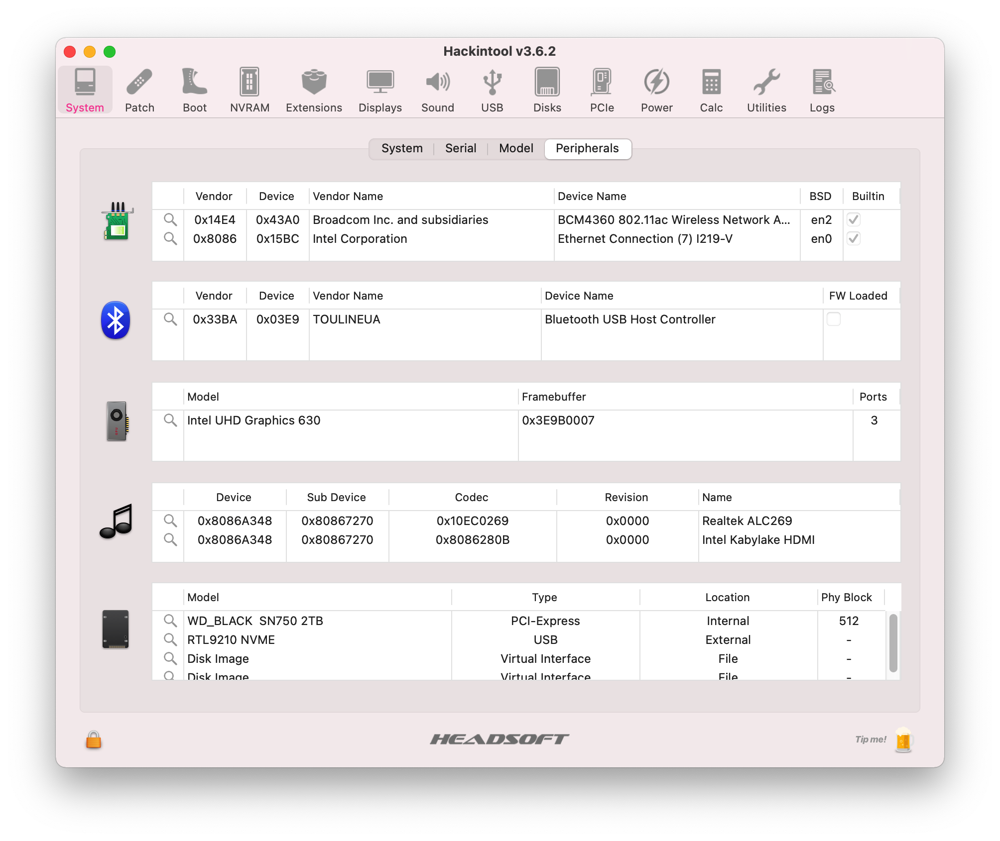

# GEEKON TinyMonster PRO Hackintosh

## 电脑配置

|   规格   |                           详细信息                           |
| :------: | :----------------------------------------------------------: |
| 电脑型号 |                       TinyMonster Pro                        |
| 操作系统 |                        macOS Big Sur                         |
|  处理器  |                 英特尔 酷睿 i9-10850K 10C20T                 |
|   内存   |                        64 GB 2933MHz                         |
| 硬盘1/2  |     Nvme Only: `WD_BLACK SN750 2TB`/Nvme+SATA双协议插槽      |
| 硬盘3/4  |                 可接SATA 2.5寸硬盘/SATA SSD                  |
|   显卡   |       Intel UHD Graphics 630/可插独立显卡/独显独立供电       |
|  显示器  |                 支持`3840x2160 4K@60Hz`双显                  |
|   声卡   |                  Realtek ALC269 `alcid=33`                   |
|   网卡   | m.2 NGFF插槽，已更换为[BCM94360Z4](https://blog.daliansky.net/uploads/WeChatandShop.png) |

## 更新日志

- 10-25-2021
  - Release `v1.2.0`
  - OpenCore `v0.7.5`
  - 修复声卡问题
  - 支持`Monterey`安装使用
- 9-17-2021
  - Release `v1.1.0`
  - OpenCore `v0.7.3`
  - 修复双屏花屏问题
- 7-28-2021
  - Release `v1.0.0`
  - OpenCore `v0.7.1`

## 截屏

 
